# Multimodal Emotion Detection

This project combines **Speech Emotion Recognition (SER)** and **Facial Emotion Recognition (FER)** to build a robust **Multimodal Emotion Detection** system. The aim is to detect human emotions using both **audio** and **visual** cues for higher accuracy and real-world applicability.

## 📚 Datasets Used

### 🎤 Speech Emotion Recognition (SER) – RAVDESS

- **Name**: Ryerson Audio-Visual Database of Emotional Speech and Song (RAVDESS)
- **Link**: [RAVDESS on kaggle](https://www.kaggle.com/datasets/uwrfkaggler/ravdess-emotional-speech-audio)
- **Description**:
  RAVDESS is a validated multimodal dataset containing **emotional speech and song** recordings. It includes **24 professional actors** (12 male, 12 female) speaking with 8 different emotions.

- **Emotions Covered**:
  - Neutral
  - Calm
  - Happy
  - Sad
  - Angry
  - Fearful
  - Disgust
  - Surprised

- **Data Format**: `.wav` files, 48 kHz sample rate, high-quality audio
- **Total Samples**: 1,440 audio files for speech (used for SER)
- **Labeling**: Emotions are encoded in the filename using a fixed schema (e.g., `03-01-05-01-02-01-12.wav`)

- **Preprocessing Steps**:
  - Extraction of audio features like:
    - MFCC (Mel-Frequency Cepstral Coefficients)
    - Chroma Frequencies
    - Spectral Contrast
    - Zero Crossing Rate
    - Root Mean Square Energy
  - Normalization and label encoding
  - Train-test split (typically 80-20)

---

### 📷 Facial Emotion Recognition (FER) – FER2013

- **Name**: Facial Expression Recognition 2013 (FER-2013)
- **Link**: [FER-2013 on Kaggle](https://www.kaggle.com/datasets/msambare/fer2013)
- **Description**:
  FER2013 is a popular dataset introduced in a Kaggle competition for facial expression recognition. It consists of grayscale images of faces categorized by emotion.

- **Emotions Covered**:
  - Angry
  - Disgust
  - Fear
  - Happy
  - Sad
  - Surprise
  - Neutral

- **Data Format**:
  - 48x48 grayscale face images stored in a CSV file
  - Each row contains a pixel string and corresponding emotion label

- **Total Samples**:
  - ~35,000 labeled images split into:
    - Training: ~28,000 images
    - Public Test: ~3,500 images
    - Private Test: ~3,500 images

- **Preprocessing Steps**:
  - Convert pixel string to NumPy arrays
  - Normalize pixel values (0–1 range)
  - One-hot encode emotion labels
  - Data augmentation (optional) for better generalization

---

These datasets were chosen for their diversity, real-world applicability, and popularity in academic benchmarks.

# Confusion Matrices

## SER

### Random Forest
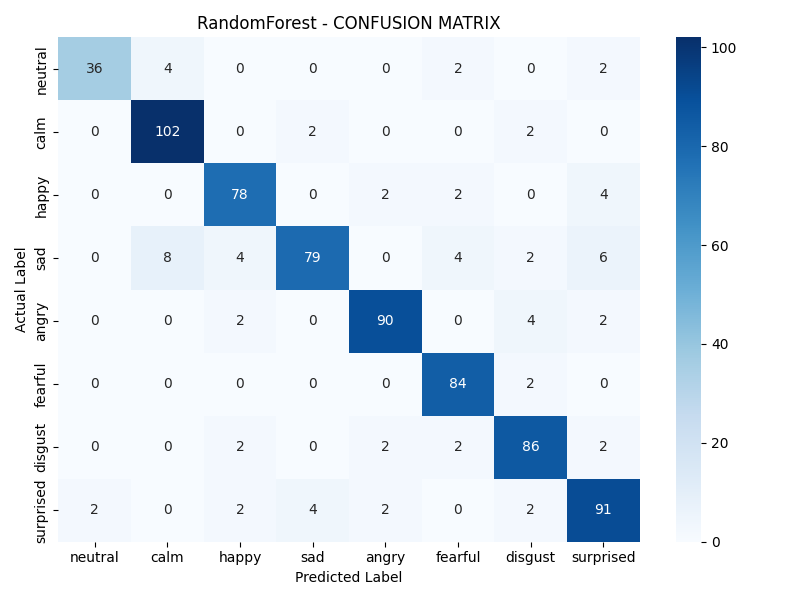
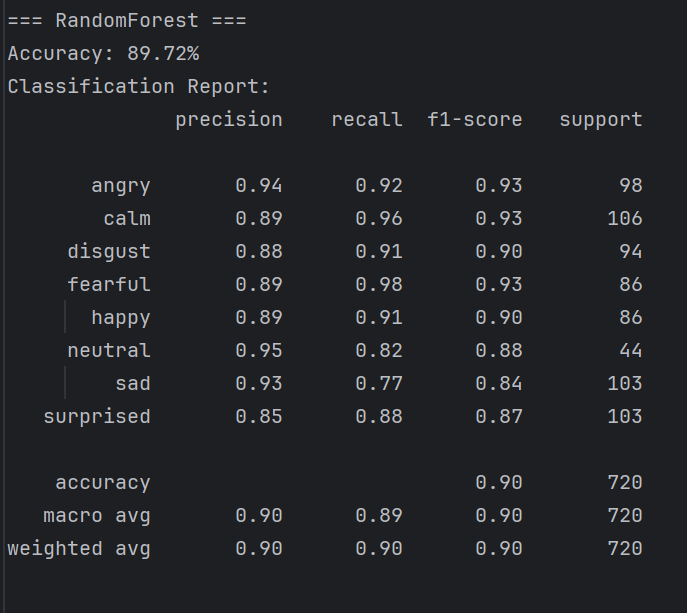

### Decision Tree
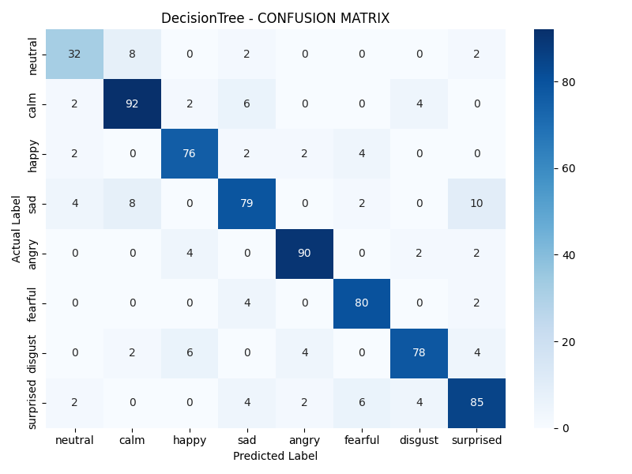
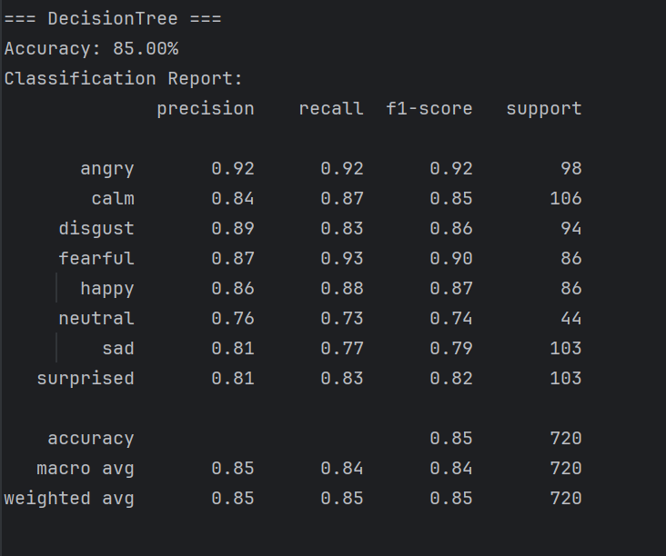

### MLP
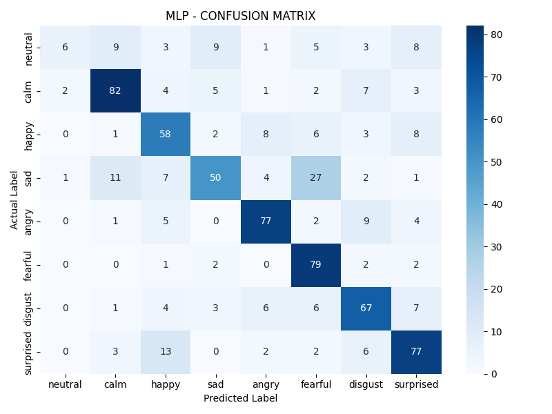
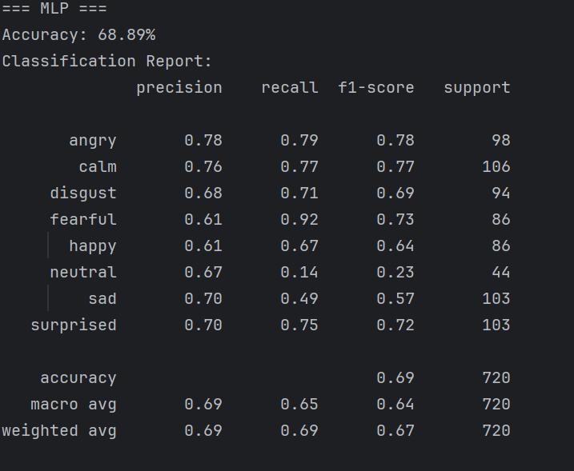

### SVM
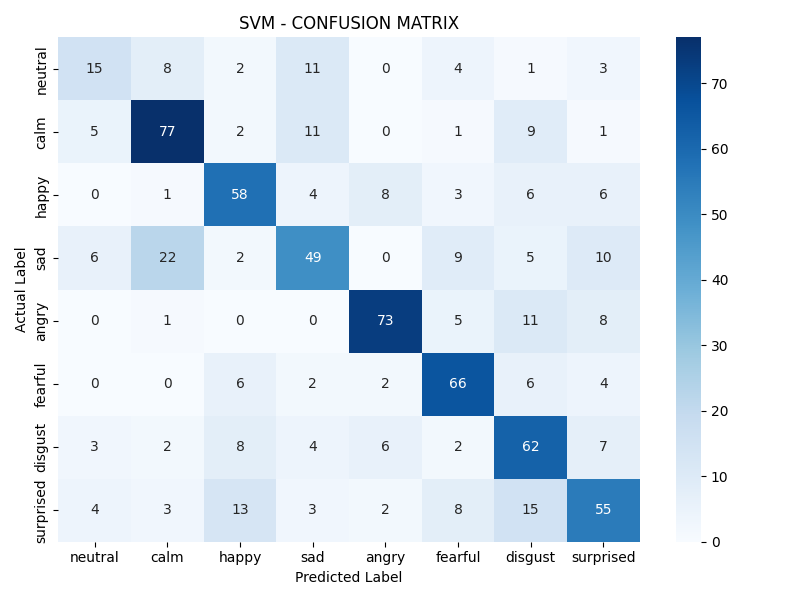
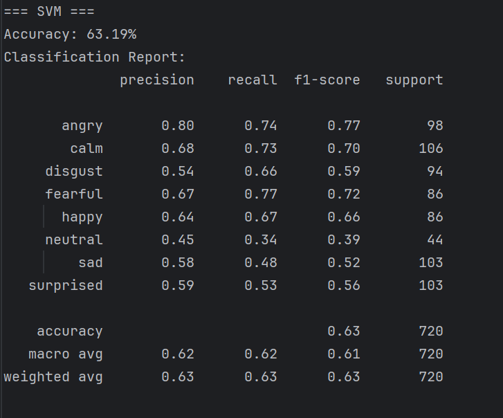

### KNN
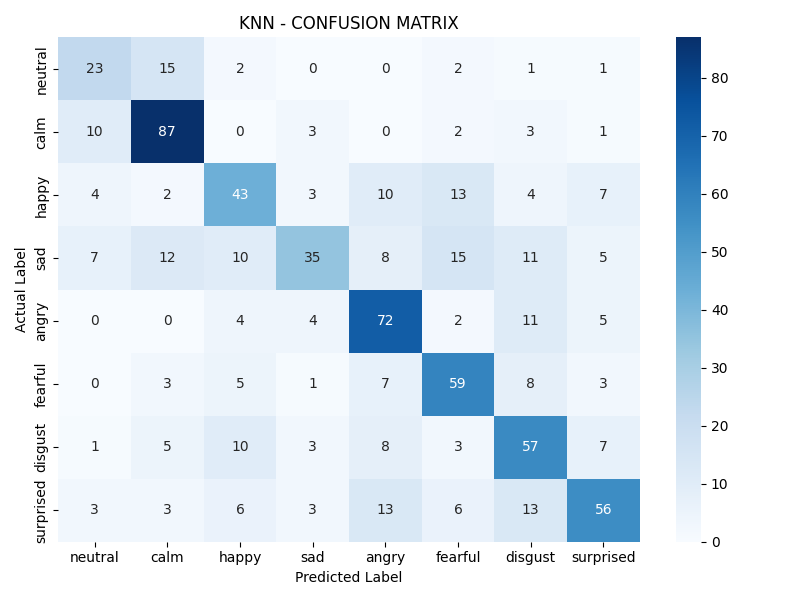
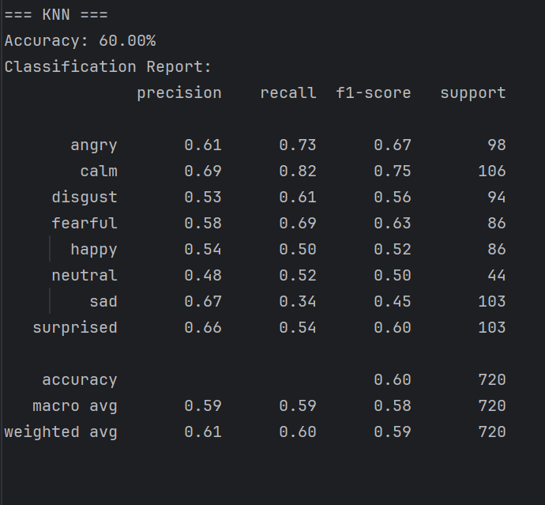

### Naive Bayes
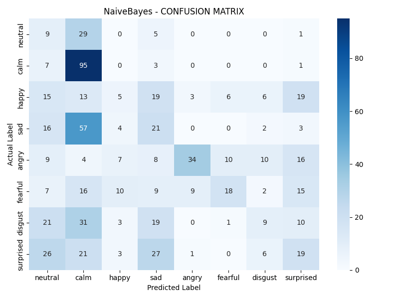
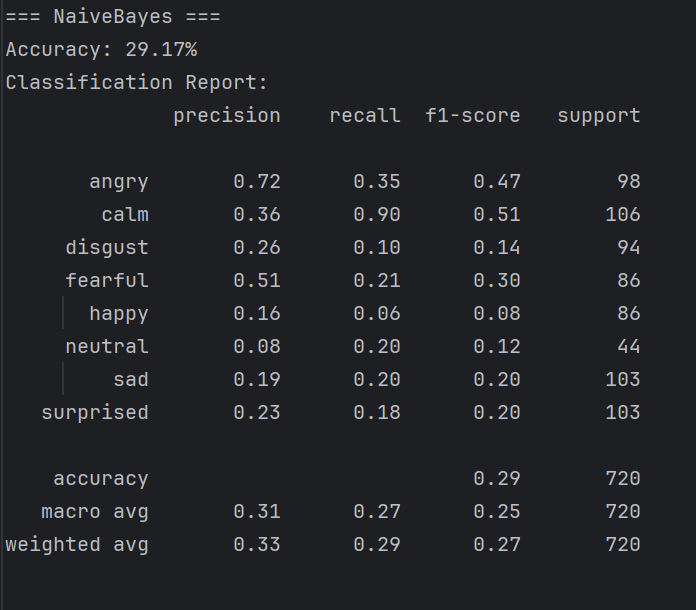

## FER
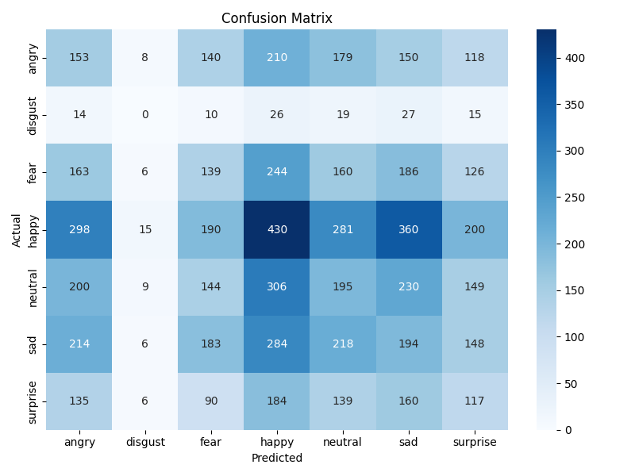
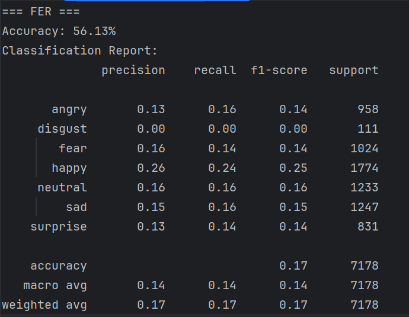
